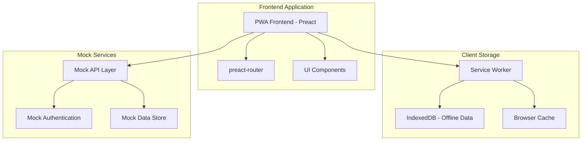

# Design Document

## Overview

SwasthLink is architected as a Progressive Web Application (PWA) optimized for low-bandwidth networks, specifically targeting 2G connectivity in rural India. The platform uses an offline-first approach with local data storage and background synchronization to ensure healthcare services remain accessible regardless of network conditions.

The system supports four distinct user roles with dedicated workflows: patients (healthcare seekers), doctors (healthcare providers), hospital administrators (institutional managers), and super administrators (platform overseers). Each role has tailored interfaces and functionality while sharing common infrastructure for authentication, data management, and communication.

## Architecture

### Frontend Architecture



### Technology Stack

**Frontend Framework:**
- Preact + Vite for minimal bundle size (3KB vs React's 42KB)
- preact-router for client-side routing
- Tailwind CSS with PurgeCSS for optimized styling

**Offline & Performance:**
- Workbox for service worker management
- IndexedDB (idb library) for local data storage
- Brotli compression via Vite plugin
- Critical CSS inlining for above-the-fold content

**Assets & Media:**
- SVG icons for scalability and small size
- WebP/AVIF images with fallbacks
- System fonts to avoid external requests
- Lazy loading for non-critical resources

## Components and Interfaces

### Core Components

#### Navigation Components
```javascript
// NavBar.jsx - Role-based navigation
interface NavBarProps {
  userRole: 'patient' | 'doctor' | 'hospital' | 'admin'
  isOffline: boolean
  networkSpeed: 'slow' | 'fast'
}

// SideBar.jsx - Contextual menu system
interface SideBarProps {
  menuItems: MenuItem[]
  collapsed: boolean
  role: UserRole
}
```

#### Utility Components
```javascript
// LowNetBanner.jsx - Network status indicator
interface LowNetBannerProps {
  connectionType: string
  showOptimizationTips: boolean
}

// Loader.jsx - Skeleton loading states
interface LoaderProps {
  type: 'form' | 'list' | 'card' | 'consultation'
  count?: number
}
```

### Role-Specific Interfaces

#### Patient Interface
```javascript
interface PatientRegistration {
  name: string
  phone: string
  preferredLanguage: 'hi' | 'ta' | 'mr' | 'en'
  otpVerified: boolean
}

interface DoctorSearch {
  hospitalType: 'government' | 'private' | 'all'
  specialty: string
  maxDistance: number
  availableNow: boolean
}

interface ConsultationBooking {
  doctorId: string
  timeSlot: Date
  symptoms: string
  urgency: 'low' | 'medium' | 'high'
}
```

#### Doctor Interface
```javascript
interface DoctorRegistration {
  personalInfo: DoctorPersonalInfo
  credentials: {
    licenseNumber: string
    licenseDocument: File
    degreeDocument: File
    idProof: File
  }
  practiceType: 'independent' | 'clinic'
}

interface OfflineEMR {
  patientId: string
  consultationNotes: string
  prescriptions: Prescription[]
  followUpRequired: boolean
  syncStatus: 'pending' | 'synced' | 'failed'
}
```

#### Hospital Interface
```javascript
interface HospitalRegistration {
  type: 'government' | 'private'
  basicInfo: HospitalBasicInfo
  documents: {
    registrationCertificate: File
    gstPan?: File // for private hospitals
    hospitalId: string // for government hospitals
  }
}

interface DoctorVerificationRequest {
  doctorId: string
  requestDate: Date
  credentials: DoctorCredentials
  status: 'pending' | 'approved' | 'rejected'
  reviewNotes?: string
}
```

## Frontend Data Models

### Client-Side State Management
```javascript
// Frontend User State
interface UserState {
  id: string
  phone: string
  role: 'patient' | 'doctor' | 'hospital' | 'admin'
  preferredLanguage: 'hi' | 'ta' | 'mr' | 'en'
  isAuthenticated: boolean
  isVerified: boolean
  profile: PatientProfile | DoctorProfile | HospitalProfile | AdminProfile
}

// Form State Models
interface RegistrationFormState {
  currentStep: number
  formData: Record<string, any>
  validationErrors: Record<string, string>
  isSubmitting: boolean
  uploadProgress: Record<string, number>
}

// UI State Models
interface AppState {
  isOffline: boolean
  networkSpeed: 'slow' | 'fast'
  currentLanguage: string
  theme: 'light' | 'dark'
  sidebarCollapsed: boolean
  notifications: Notification[]
}
```

### Local Storage Models
```javascript
// IndexedDB Schema for Offline Data
interface OfflineEMRRecord {
  id: string
  patientId: string
  doctorId: string
  consultationNotes: string
  prescriptions: LocalPrescription[]
  timestamp: Date
  syncStatus: 'pending' | 'synced' | 'failed'
}

interface CachedUserData {
  userId: string
  profileData: any
  lastUpdated: Date
  expiresAt: Date
}

interface QueuedAction {
  id: string
  action: 'register' | 'book' | 'consult' | 'prescribe'
  payload: any
  timestamp: Date
  retryCount: number
}
```

## Error Handling

### Network Error Handling
```javascript
class NetworkErrorHandler {
  static handleOfflineMode() {
    // Show offline banner
    // Queue operations for later sync
    // Switch to cached data
  }
  
  static handleSlowConnection() {
    // Show low-bandwidth banner
    // Reduce image quality
    // Defer non-critical requests
  }
  
  static handleConnectionFailure(error) {
    // Retry with exponential backoff
    // Fallback to cached data
    // Show user-friendly error message
  }
}
```

### Validation Error Handling
```javascript
class ValidationErrorHandler {
  static validateRegistration(data, userType) {
    // Role-specific validation rules
    // Return structured error messages
    // Support multiple languages
  }
  
  static validateConsultationData(consultation) {
    // Ensure required fields
    // Validate time slots
    // Check doctor availability
  }
}
```

### Sync Error Handling
```javascript
class SyncErrorHandler {
  static handleSyncFailure(queueItem) {
    // Implement retry logic
    // Handle conflicts
    // Notify user of sync status
  }
  
  static resolveDataConflicts(localData, serverData) {
    // Timestamp-based resolution
    // User-prompted resolution for critical data
    // Automatic merge for non-conflicting changes
  }
}
```

## Testing Strategy

### Unit Testing
- Component testing with Preact Testing Library
- Utility function testing (validation, formatting, calculations)
- Service worker functionality testing
- IndexedDB operations testing

### Integration Testing
- API integration testing with mock servers
- Offline/online state transitions
- Role-based routing and authentication
- Cross-browser compatibility testing

### Performance Testing
- Bundle size analysis and optimization
- Network throttling simulation (2G, 3G conditions)
- Memory usage monitoring for long-running sessions
- Service worker cache effectiveness

### User Acceptance Testing
- Multi-language interface testing
- Accessibility compliance (WCAG 2.1 AA)
- Mobile device testing across different screen sizes
- Real-world network condition testing

### Low-Bandwidth Specific Testing
```javascript
// Performance budget constraints
const PERFORMANCE_BUDGET = {
  initialBundle: '150KB', // gzipped
  criticalCSS: '14KB',    // above-the-fold
  imageOptimization: 'WebP with JPEG fallback',
  fontLoading: 'system fonts only',
  thirdPartyScripts: 'none'
}

// Network simulation testing
const NETWORK_CONDITIONS = {
  '2G': { downloadThroughput: 250 * 1024, uploadThroughput: 50 * 1024, latency: 300 },
  'Slow 3G': { downloadThroughput: 400 * 1024, uploadThroughput: 400 * 1024, latency: 400 },
  'Offline': { downloadThroughput: 0, uploadThroughput: 0, latency: 0 }
}
```

### Frontend Security Testing
- Client-side form validation testing
- Role-based route protection verification
- Local storage data handling
- File upload UI security testing
- XSS prevention in user inputs

## Performance Optimization Strategy

### Bundle Optimization
- Code splitting by user role
- Dynamic imports for non-critical features
- Tree shaking for unused code elimination
- Preact/compat for React library compatibility

### Caching Strategy
```javascript
// Service Worker Caching Strategy
const CACHE_STRATEGIES = {
  'app-shell': 'CacheFirst',      // HTML, CSS, JS
  'api-data': 'NetworkFirst',     // Dynamic content
  'images': 'CacheFirst',         // Static assets
  'consultations': 'StaleWhileRevalidate' // Real-time data
}
```

### Progressive Enhancement
- Core functionality works without JavaScript
- Enhanced features load progressively
- Graceful degradation for older browsers
- Touch-friendly interfaces for mobile devices

This frontend-focused design provides a robust foundation for building SwasthLink as a low-bandwidth optimized telemedicine PWA that can serve rural healthcare needs effectively. The design emphasizes client-side optimization, offline functionality, and progressive enhancement while using mock services for backend functionality during development.